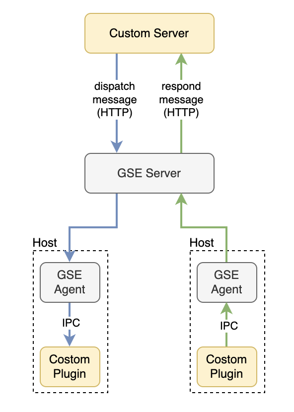

# Plugin-Message 平台化自定义插件上下行信令通信

## 基本结构


GSE提供基于托管插件的、跨云区域的自定义信息上下行通信服务。
下行：用户的自定义Server可以通过GSE提供的HTTP API接口，对指定agent上的托管插件发送自定义信息。
上行：用户的插件可以通过GSE Agent提供的插件通信能力，向已注册的Server回调HTTP地址发送自定义信息。

## 快速接入
### 1. 注册插件消息槽和回调地址
用户提供插件名字`PluginName`和上行消息的回调HTTP地址`HTTPCallback`，由GSE管理员将其注册到服务中。

> PluginName 必须与Agent上托管的插件进程名`procName`一致
> HTTPCallback必须是一个合法的HTTP回调地址，如`http://192.168.1.1:8080/callback`。固定端口和路径，地址推荐使用CLB。

注册完毕后，用户将会获得以下信息：
- `SlotID`: 消息槽ID，它绑定了你的插件名`PluginName`。在下行消息时需要指定`SlotID`，这样GSE就知道要把消息发给你的插件。
- `Token`：消息Token，它是该`SlotID`的身份校验标识，在下行消息时需要带上以进行验证。

### 2. 部署你的插件
将你的插件托管到GSE Agent

通过Agent提供的插件通信能力（Unix下为IPC，Windows下为Local STREAM Socket），连接到本机的Agent上。
SDK提供全套的通信链接管理、上行消息接口函数、下行消息回调函数等。

```golang
import (
    agentmessage "github.com/TencentBlueKing/bk-gse-sdk/go/service/agent-message"
    "github.com/TencentBlueKing/bk-gse-sdk/go/types"
)

func main() {
    // 初始化client SDK
    // 此处需要填写:
    // - PluginName: 插件名称, 需要与托管的进程名/注册到GSE的插件名都保持一致
    // - PluginVersion: 插件版本
    // - DomainSocketPath: unix(linux + macos)下, 使用的是本地ipc文件连接, 需要指定文件路径
    //      若是Windows下, 使用的是本地监听的TCP端口, 改用agentmessage.WithLocalSocketPort(uint)
    // - RecvCallback: 收到server下行消息时的回调函数
    // - Logger: 可指定用户自己的日志实现, 默认是打stdout日志, 也可以使用types.NewEmptyLogger关闭日志
    client, err := agentmessage.New(
        agentmessage.WithPluginName(config.PluginName),
        agentmessage.WithPluginVersion(config.PluginVersion),
        agentmessage.WithDomainSocketPath(config.DomainSocketPath),
        agentmessage.WithRecvCallback(MessageCallback),
        agentmessage.WithLogger(types.NewDefaultLogger(1)),
    )
    if err != nil {
        panic(err)
    }

    // 开始连接Agent, Launch会阻塞至首次成功连接为止, 可以通过context来控制尝试连接的超时时间
    // 一旦成功Launch之后, client会自动管理与Agent之间的连接, 并对异常情况进行自动重连
	// launch client, it will try to connect to agent and keep the connection.
    if err = client.Launch(ctx); err != nil {
        panic(err)
    }

    // 发送消息到注册的Server
    // messageID作为当前消息的标识, 会一并发给Server的回调接口
    // content则为消息内容
    if err = client.SendMessage(ctx, messageID, []byte("[this is the message from example client]")); err != nil {
        panic(err)
    }
}
```

### 3. 部署你的服务
将你的服务部署，并开放`HTTPCallback`的有效地址，以等待GSE Server的回调请求。

SDK提供基于APIGateway的GSE Server接口函数，可以下发消息到指定Agent列表，
若用户有自己的HTTP Request管理方式，也可以仅仅使用SDK提供的协议转换服务，它提供自定义类型协议到GSE Server协议之间的自由转换。

```golang
import (
    serverapi "github.com/TencentBlueKing/bk-gse-sdk/go/service/server-api"
    "github.com/TencentBlueKing/bk-gse-sdk/go/types"
)

func main() {
    // 初始化server SDK
    // 此处需要填写:
    // - BaseURL: 基础地址, 例如正式环境应该是GSE的APIGW根地址, 如http://bkapi.example.com/api/bk-gse/prod
    // - Client: HTTP client实例, 若不指定则会自动创建一个新的
    // - ClusterAuth: 填入注册GSE插件时获得的SlotID和Token
    // - APIGwAuth: 填入APIGW的认证信息
    // - Logger: 可指定用户自己的日志实现, 默认是打stdout日志, 也可以使用types.NewEmptyLogger关闭日志
    client, err := serverapi.New(
        serverapi.WithBaseURL(config.GSEBaseURL),
        serverapi.WithClient(http.DefaultClient),
        serverapi.WithClusterAuth(config.SlotID, config.Token),
        serverapi.WithAPIGwAuth(config.AppCode, config.AppSecret),
        serverapi.WithLogger(types.NewDefaultLogger(1)),
    )
    if err != nil {
        panic(err)
    }

    // 发送消息到指定的Agent上的插件
    // messageID作为当前消息的标识, 会一并发给Agent插件上的的回调函数
    // content为消息内容
    // agentIDList为目标的agent-id列表
    resp, err := client.Cluster().
        PluginDispatchMessage(ctx, messageID, []byte("[this is the message from example server]"), config.AgentIDList...)
    if err != nil {
        panic(err)
    }

    // 如果用户有自己的APIGW Client实现, 也可以不用SDK的这个功能, 只使用协议转换
    // 初始化一个最基本的client, 只带有GSE认证信息
    clientProtocol, err := serverapi.New(
        serverapi.WithClusterAuth(config.SlotID, config.Token),
        serverapi.WithLogger(types.NewEmptyLogger()),
    )
    if err != nil {
        panic(err)
    }

    // 将Server要下行的消息转换为GSE的协议body, 然后自行发送
    // 这里的buffer可以直接作为body发送给GSE的接口
    buffer, err := clientProtocol.Cluster().EncoderDecoder().EncodePluginDispatchMessageRequest(messageID, content, config.AgentIDList...)
    
    // Do request...

    // 返回的消息, 也可以用SDK解开
    // 这里只有发送失败的Agent才会有消息结果和错误信息, 如果agent-id没有在结果里则是成功的
    resp, err := clientProtocol.Cluster().EncoderDecoder().DecodePluginDispatchMessageResponse(body)
}

// 用户Server中的回调接口处理函数
func (s *Server) HTTPCallbackHandler(resp http.ResponseWriter, req *http.Request) {
    defer func() {
        _ = req.Body.Close()
    }()

    // 收到来自GSE的回调消息, 说明有Agent上的插件向Server发消息了
    data, err := io.ReadAll(req.Body)
    if err != nil {
        panic(err)
    }

    // 使用SDK中的EncoderDecoder解开GSE的协议, 获得消息内容和来源信息
    message, err := s.client.Cluster().EncoderDecoder().DecodePluginRespondMessageCallback(data)
    if err != nil {
        panic(err)
    }

    fmt.Printf("[%s] received message from agent(%s): %s\n",
        message.MessageID, message.AgentID, message.Content)

    resp.WriteHeader(http.StatusOK)
}
```

## 快速体验
[基于Golang SDK的快速体验](plugin_message_quickstart_with_go.md)