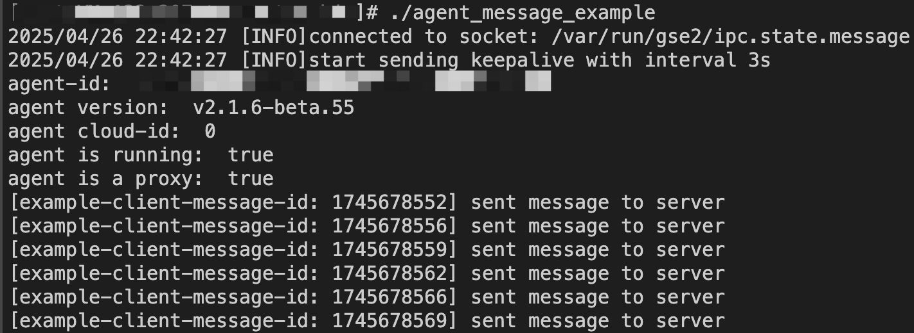
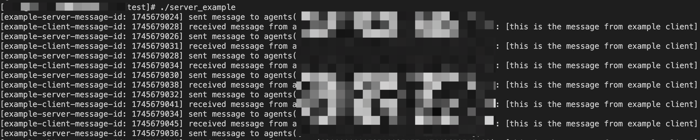
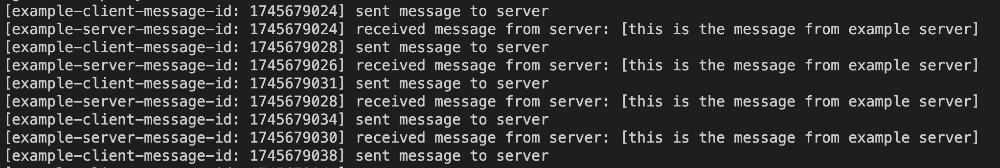

# 基于Golang SDK的插件上下行信令通信快速体验

### 1. 准备工作
确定体验用的`PluginName`，如：`sdk_test`
确定体验服务的回调地址`HTTPCallback`，如：`http://192.168.1.1:8080/callback`
确定该插件被注册到GSE服务中，并拿到对应的`SlotID`和`Token`

### 1. 编译SDK Example

编译`agent_message_example`，这是一个简单的插件示例，它有以下功能：
- 通过SDK连接Agent，定时发送消息到Server
- 接收Server下发给它的消息，并打印出来

```bash
cd go/service/agent-message/example
make
```

编译`server_example`，这是一个简单的Server示例，他有以下功能：
- 通过SDK请求GSE Server，定时发送消息到Agent
- 接收Agent上行的消息，并打印出来

```bash
cd go/service/server/example
make
```

### 2. 部署agent_message_example
找到一台装有GSE Agent的机器，增加一个Agent的托管配置到`etc/.proc`文件中：
```json
{
    "proc": [
        {
            "procName": "sdk_test",
            "type": 1
        }
    ]
}
```
> 注意这不是真正的托管，在正式部署时应该通过节点管理正规地托管插件。

创建配置文件`agent_message_example.json`

```json
{
    "plugin_name": "sdk_test",
    "plugin_version": "v1.0.0",
    "domain_socket_path": "/var/run/gse2/ipc.state.message",
    "pid_file": "/var/run/gse2/agent_message_example.pid"
}
```
> 注意这里的`domain_socket_path`应为当前机器Agent的ipc文件地址。

拉起`agent_message_example`

```bash
./agent_message_example
```

可以看到插件成功地与Agent建立了链接，并定时地发送上行消息。



### 3. 部署server_example
创建配置文件`server_example.json`

```json
{
  "listen_addr": "0.0.0.0:8000",
  "slot_id": ${SlotID},
  "token": "${Token}",
  "app_code": "",
  "app_secret": "",
  "gse_base_url": "http://example.com/api/bk-gse/prod",
  "agent_id_list": [
    "example-agent-id"
  ]
}
```
> 注意这里需要填写的`listen_addr`，需要是你注册的`HTTPCallbak`所能访问的地址。
> `gse_base_url`则是当前环境GSE Server在APIGateway上的根地址
> `agent_id_list`填入`agent_message_example`所在的机器的Agent-id

拉起`server_example`

```bash
./server_example
```

可以看到Server定时下发消息到插件，并成功接收到了插件发送的上行消息



此时Agent侧也能收到Server下行的消息了

